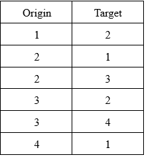

# graphic-theoretic-problems

Graphs are mathematical structures used to model pair-wise relations between objects from a certain collection. Graph can be defined a set V of vertices and set of edges. Where, V is collection of |V| = n abstract data types. These abstract data types are also called nodes. 

In computer science, graphs are used to represent networks of communication, data organization, computational devices, the flow of computation, etc. For instance, the link structure of a website can be represented by a directed graph, in which the vertices represent web pages and directed edges represent links from one page to another. 

MapReduce is a framework for processing parallelizable problems across huge datasets using a large number of computers (nodes), collectively referred to as a cluster or a grid. MapReduce is useful in a wide range of applications, including distributed pattern-based searching, distributed sorting, web link-graph reversal, Singular Value Decomposition, web access log stats, inverted index construction, document clustering, machine learning, and statistical machine translation.

Using mapreduce method to solve graph problem is a tempting idea. Because nowadays, data is increasing in size every day, traditional ways of data analysis will finally be out-of-date. Taking the advantage of parallel computing is an inevitable trend. In this project, we tried to solve several graph problems by writing a program using Hadoop streaming.

## problem 1

1)	Given a node N, find all nodes exactly K hops away. Put another way, starting at a domain, find all web pages one can reach in 3 clicks.

## problem 2

2)	For a given pair of nodes X and Y, find the shortest distance from X to Y where distance is defined as the number of links to get from X to Y in a directed graph.

## problem 3

3)	For a node X, find the transitive closure of X (that is, the set of all nodes reachable from X).

## setting 

This project used a 16-node graph we created to test and demonstrate programs and algorithm. A google web graph from Google programming contest was also used to test and analysis programs. Since this is just an elementary exploration, we used a relatively simple model, unweighted directed graph. The graph given as a table with two columns, the first column is the ID of the start node while the second column is the ID of the target point. For example:

#

